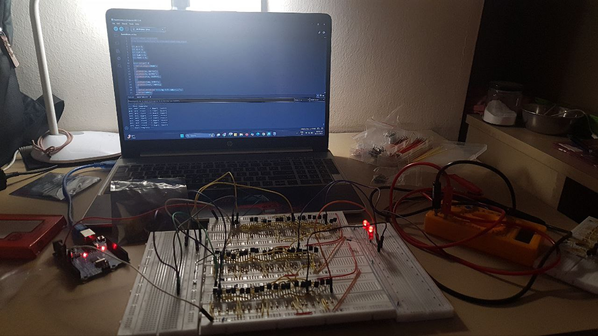

# 3-Bit NMOS Ripple Carry Adder

## Overview
This project implements a **3-bit ripple carry adder built entirely using discrete NMOS transistors and resistors**, without using any prebuilt digital ICs. The design was created for an **Electronics Exhibition organized by the IEEE Student Hub**, where the project was awarded **2nd Place**.

The objective of this project was to understand **digital logic at the device level** by implementing logic gates directly using **NMOS transistor networks** rather than relying on standard logic ICs.

This hands-on implementation demonstrates how **complex arithmetic circuits can be built from basic transistor-level logic.**

---
## Project Images

### Circuit Setup



### Wiring Layout

.jpg)

## Simulation (NI Multisim)

To verify the logic before building the hardware circuit, a **full adder was first designed and simulated using NI Multisim**.

The simulation demonstrates the correct operation of:

- Sum output: S = A ⊕ B ⊕ Cin
- Carry output: Cout = AB + ACin + BCin

The Multisim file included in this repository contains the transistor-level implementation used to validate the design before assembling the discrete hardware circuit.

### File

```
full_adder_multisim.ms14
```

You can open this file using **NI Multisim** to view and run the simulation.
## Project Highlights

- 3-bit ripple carry adder
- Built completely using **discrete NMOS transistors**
- No logic ICs were used
- Transistor-level implementation of NAND gates
- Manual wiring of more than **112 connections**
- Debugged and assembled entirely by hand

---

## Circuit Design

The 3-bit adder adds two 3-bit binary numbers:

A = A₂ A₁ A₀  
B = B₂ B₁ B₀  

Output:

S = S₂ S₁ S₀  
Carry out = C₃

The design uses a **ripple carry architecture**, where the carry output of one stage becomes the carry input of the next stage.


---

## Gate Level Implementation

Each **Full Adder** was implemented using **NAND gate logic**.

### Full Adder Composition

Each full adder consists of:

- 9 NAND gates

Since the circuit contains **3 full adders**:

Total NAND gates = **27**

---

## Transistor Level Implementation

Each **NAND gate** was implemented using:

- 2 NMOS transistors
- Pull-up resistor
- Pull-down resistor

### Components Used

| Component | Value |
|----------|-------|
| NMOS Transistors | 2 per NAND gate |
| Pull-up Resistor | 470 Ω |
| Pull-down Resistor | 100 kΩ |

Total approximate hardware used:

- **54 NMOS transistors**
- **54 resistors**
- **112+ manual wire connections**

---

## Key Learning Outcomes

This project helped develop a deeper understanding of:

- Transistor-level digital logic design
- Implementation of logic gates using NMOS networks
- Ripple carry propagation
- Hardware debugging techniques
- Manual circuit assembly and verification
- Practical limitations of discrete logic implementations

---

## Challenges Faced

Building the circuit entirely with discrete components introduced several challenges:

- Loose wiring causing intermittent logic errors
- Debugging incorrect carry propagation
- Managing a large number of manual connections
- Ensuring stable voltage levels across stages

Several late-night debugging sessions were required to locate faulty connections and stabilize the circuit.

---

## Result

The circuit successfully performs **3-bit binary addition**, and the project received **2nd Place** in the Electronics Exhibition organized by the **IEEE Student Hub**.

---

## Future Improvements

Possible future enhancements include:

- Implementing the design using **CMOS logic**
- Expanding the design to a **4-bit or 8-bit adder**
- Simulating the circuit in **Cadence / LTSpice**
- Designing a **PCB implementation**
- Analyzing **propagation delay and power consumption**

---

## Author

Rajveer Taneja  
Electronics and Communication Engineering Student
